Compare TPM
================

## Analysis gene expression - genome

### BUSCO genes - masked repeats

``` r
library(reshape)
library(ggplot2)

ws_quant = read.delim("/projects/spruceup_scratch/dev/SprucePaper2018/GeneFamilies/Salmon/RepeatsMaskedGenes/BUSCOs/WS77111/Q903_WS_quant/quant.sf",header=T)
ws_quantGF = read.delim("/projects/spruceup_scratch/dev/SprucePaper2018/GeneFamilies/Salmon/RepeatsMaskedGenes/GeneFamilies/WS77111/Q903_WS_quant/quant.sf", header = T)
q_quantGF = read.delim("/projects/spruceup_scratch/dev/SprucePaper2018/GeneFamilies/Salmon/RepeatsMaskedGenes/GeneFamilies/Q903/Q903_WS_quant/quant.sf",header=T)
q_quant = read.delim("/projects/spruceup_scratch/dev/SprucePaper2018/GeneFamilies/Salmon/RepeatsMaskedGenes/BUSCOs/Q903/Q903_WS_quant/quant.sf", header = T)

par(mfrow=c(1,2))
{plot(ws_quant$TPM,q_quant$TPM,xlim=c(0,10000),ylim=c(0,10000), xlab = "WS busco - TPM", ylab = "Q903 busco - TPM") 
abline(a=1, b=1)}
{plot(ws_quant$NumReads,q_quant$NumReads,xlim=c(0,10000),ylim=c(0,10000),xlab = "WS busco - num reads", ylab = "Q903 busco - num reads") 
abline(a=1, b=1)}
```

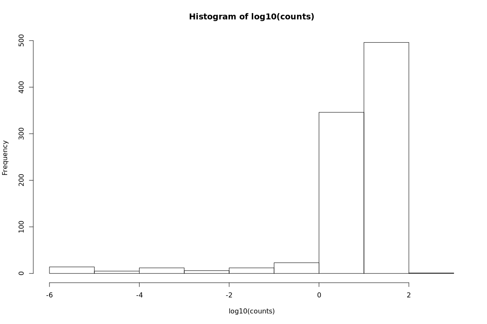<!-- -->

``` r
summary(ws_quant$NumReads)
```

    ##     Min.  1st Qu.   Median     Mean  3rd Qu.     Max. 
    ##        0     2662    58630   405091   380541 19731559

``` r
summary(q_quant$NumReads)
```

    ##     Min.  1st Qu.   Median     Mean  3rd Qu.     Max. 
    ##        0     3964    88124   615015   567004 30704798

``` r
summary(ws_quant$TPM)
```

    ##     Min.  1st Qu.   Median     Mean  3rd Qu.     Max. 
    ##     0.00    32.12   349.11  1483.68  1402.77 40730.60

``` r
summary(q_quant$TPM)
```

    ##     Min.  1st Qu.   Median     Mean  3rd Qu.     Max. 
    ##     0.00    30.21   351.76  1483.68  1416.57 41803.48

``` r
cor(ws_quant$TPM,q_quant$TPM)
```

    ## [1] 0.9968534

``` r
cor(ws_quant$NumReads,q_quant$NumReads)
```

    ## [1] 0.9987124

``` r
#-------------------------------------------------------------------------------
##Calculate Z score - WS77111
#POPULATION PARAMETER CALCULATIONS

counts = ws_quant$TPM
hist(log10(counts))
hist(log(counts))
```

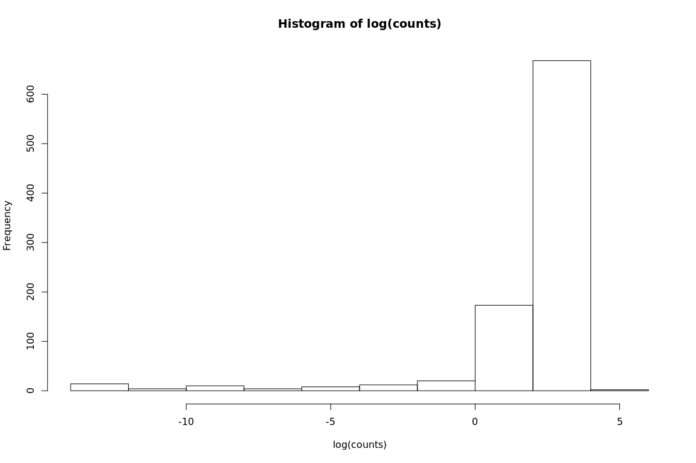<!-- -->

``` r
logTrans <- function(vals) {
   vals_log = log(vals)
   vals_log[is.infinite(vals_log)]<- NA
   return(vals_log)
}

counts_log = logTrans(counts)

pop_sd <- sd(counts_log,na.rm = T)*sqrt((length(counts_log)-1)/(length(counts_log)))
pop_mean <- mean(counts_log, na.rm = T)

calc_zScore <- function(vector_vals, sd, mean) {
   Zvector_vals = (vector_vals - mean) / sd
   return(Zvector_vals)
}

ws_quantGF$z_vals = calc_zScore(logTrans(ws_quantGF$TPM), pop_sd, pop_mean)
sum(abs(ws_quantGF$z_vals) > 2, na.rm = T)
```

    ## [1] 838

``` r
#-------------------------------------------------------------------------------
##Calculate Z score - Q903
#POPULATION PARAMETER CALCULATIONS

counts = q_quant$TPM
hist(log10(counts))
hist(log(counts))
```

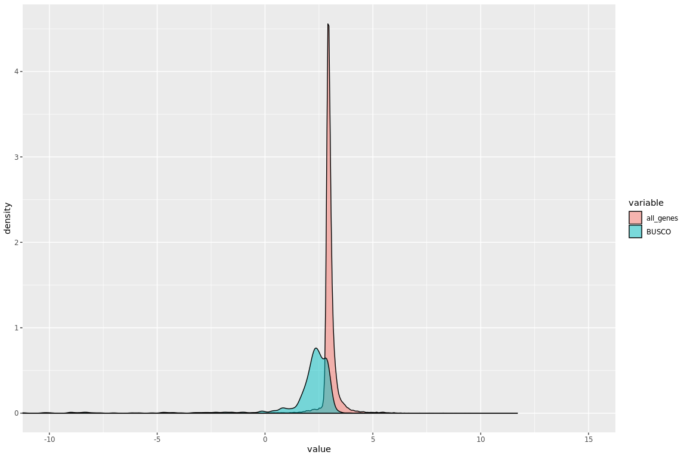<!-- -->

``` r
counts_log = logTrans(counts)

pop_sd <- sd(counts_log,na.rm = T)*sqrt((length(counts_log)-1)/(length(counts_log)))
pop_mean <- mean(counts_log, na.rm = T)

q_quantGF$z_vals = calc_zScore(logTrans(q_quantGF$TPM), pop_sd, pop_mean)
sum(abs(q_quantGF$z_vals) > 2, na.rm = T)
```

    ## [1] 1484

``` r
#-----------------------------------------------------------------------
#plot values - Q903
q_quant$TPMlog = logTrans(q_quant$TPM)
q_quantmelt = melt(q_quant[,c("Name","TPMlog")])
q_quantmelt$variable = rep("BUSCO",nrow(q_quantmelt))
q_quantGF$TPMlog = logTrans(q_quantGF$TPM)
q_quantGFmelt = melt(q_quantGF[,c("Name","TPMlog")])
q_quantGFmelt$variable = rep("gene_family",nrow(q_quantGFmelt))

q_quantAll = rbind(q_quantGFmelt,q_quantmelt)

ggplot(q_quantAll, aes(x = value, fill = variable)) + 
  geom_density(alpha = 0.5) + 
  coord_cartesian(xlim = c(-10, 15))
```

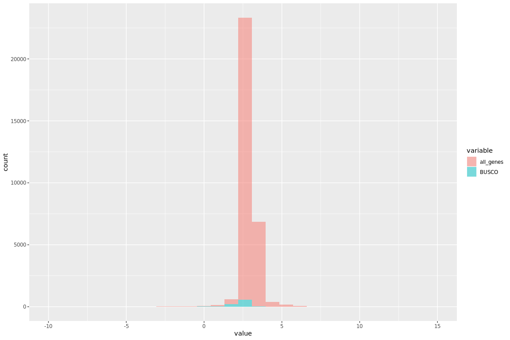<!-- -->

``` r
ggplot(q_quantAll, aes(x = value, fill = variable)) + 
  geom_histogram(alpha = 0.5) +
  coord_cartesian(xlim = c(-10, 15))
```

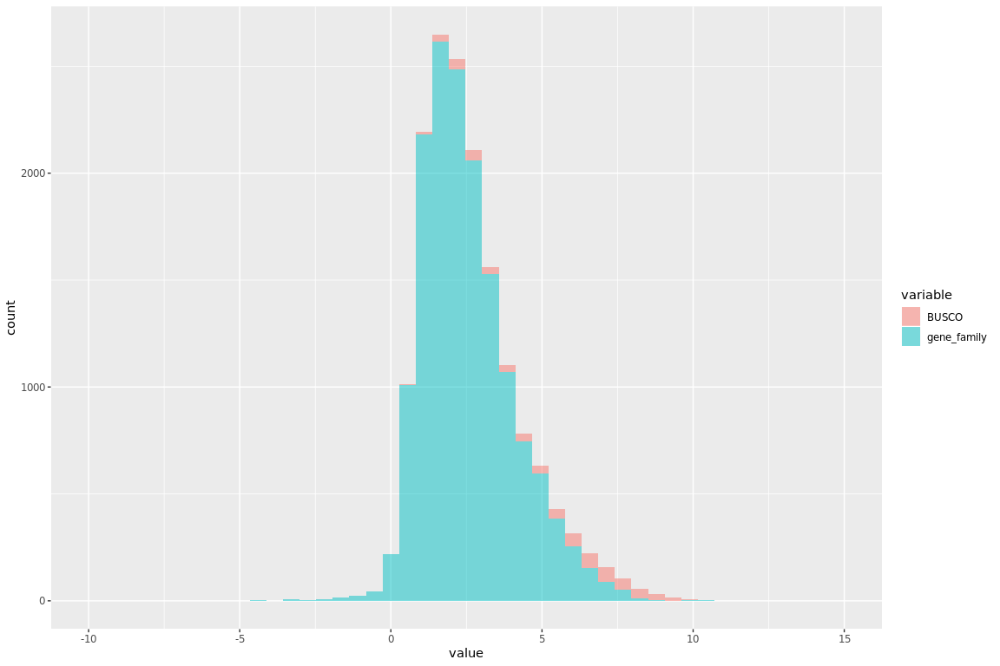<!-- -->

``` r
#plot values - WS77111
ws_quant$TPMlog = logTrans(ws_quant$TPM)
ws_quantmelt = melt(ws_quant[,c("Name","TPMlog")])
ws_quantmelt$variable = rep("BUSCO",nrow(ws_quantmelt))
ws_quantGF$TPMlog = logTrans(ws_quantGF$TPM)
ws_quantGFmelt = melt(ws_quantGF[,c("Name","TPMlog")])
ws_quantGFmelt$variable = rep("gene_family",nrow(ws_quantGFmelt))

ws_quantAll = rbind(ws_quantGFmelt,ws_quantmelt)

ggplot(ws_quantAll, aes(x = value, fill = variable)) + 
  geom_density(alpha = 0.5) + 
  coord_cartesian(xlim = c(-10, 15))
```

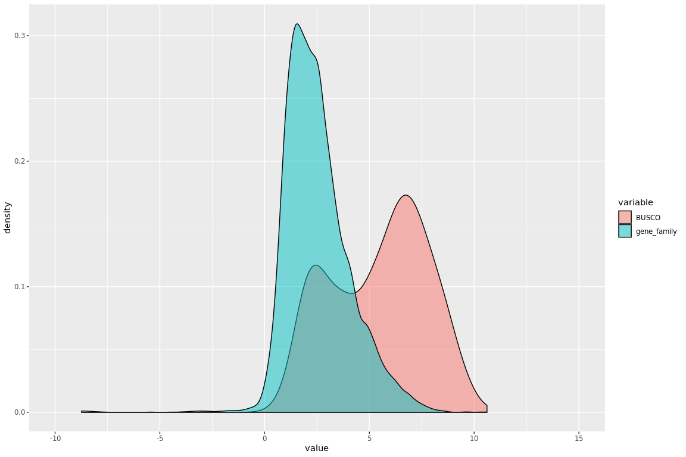<!-- -->

``` r
ggplot(ws_quantAll, aes(x = value, fill = variable)) + 
  geom_histogram(alpha = 0.5) + 
  coord_cartesian(xlim = c(-10, 15))
```

<!-- -->

``` r
table(ws_quantAll$variable)
```

    ## 
    ##       BUSCO gene_family 
    ##         674       15612

### BUSCO genes - Transcript Sequences

``` r
ws_quantTrans <- read.delim("/projects/spruceup_scratch/dev/SprucePaper2018/GeneFamilies/Salmon/Transcripts/BUSCO/WS77111/Q903_WS_quant/quant.sf",header = T)
q_quantTrans <- read.delim("/projects/spruceup_scratch/dev/SprucePaper2018/GeneFamilies/Salmon/Transcripts/BUSCO/Q903/Q903_WS_quant/quant.sf", header = T)
ws_quantTransGF <- read.delim("/projects/spruceup_scratch/dev/SprucePaper2018/GeneFamilies/Salmon/Transcripts/GeneFamilies/WS77111/Q903_WS_quant/quant.sf",header = T)
q_quantTransGF <- read.delim("/projects/spruceup_scratch/dev/SprucePaper2018/GeneFamilies/Salmon/Transcripts/GeneFamilies/Q903/Q903_WS_quant/quant.sf", header = T)


par(mfrow=c(1,2))
{plot(ws_quantTrans$TPM,q_quantTrans$TPM,xlim=c(0,10000),ylim=c(0,10000), xlab = "WS busco - TPM", ylab = "Q903 busco - TPM") 
abline(a=1, b=1)}
{plot(ws_quantTrans$NumReads,q_quantTrans$NumReads,xlim=c(0,10000),ylim=c(0,10000),xlab = "WS busco - num reads", ylab = "Q903 busco - num reads") 
abline(a=1, b=1)}
```

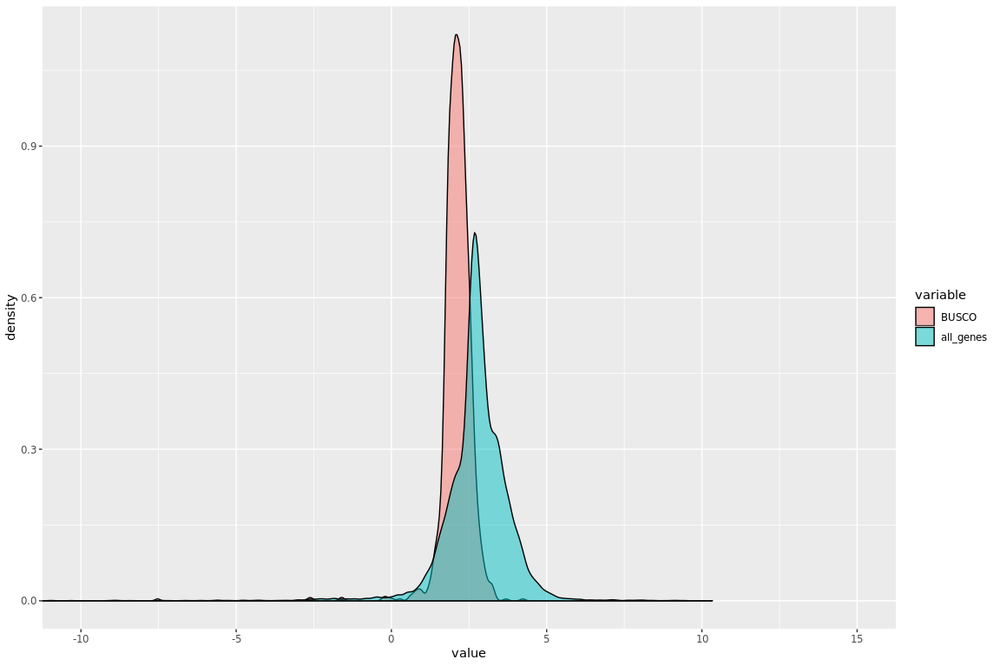<!-- -->

``` r
summary(ws_quantTrans$NumReads)
```

    ##    Min. 1st Qu.  Median    Mean 3rd Qu.    Max. 
    ##      11     556    2317   84341   34504 6745210

``` r
summary(q_quantTrans$NumReads)
```

    ##    Min. 1st Qu.  Median    Mean 3rd Qu.    Max. 
    ##       0     868    3499  116820   52681 6368051

``` r
summary(ws_quantTrans$TPM)
```

    ##     Min.  1st Qu.   Median     Mean  3rd Qu.     Max. 
    ##     0.20    13.45    59.08  1483.68   750.17 59316.61

``` r
summary(q_quantTrans$TPM)
```

    ##     Min.  1st Qu.   Median     Mean  3rd Qu.     Max. 
    ##     0.00    14.51    61.13  1483.68   778.55 60415.37

``` r
cor(ws_quantTrans$TPM,q_quantTrans$TPM)
```

    ## [1] 0.9754726

``` r
cor(ws_quantTrans$NumReads,q_quantTrans$NumReads)
```

    ## [1] 0.9002639

``` r
#-------------------------------------------------------------------------------
##Calculate Z score - WS77111
#POPULATION PARAMETER CALCULATIONS

counts = ws_quantTrans$TPM
hist(log10(counts))
hist(log(counts))
```

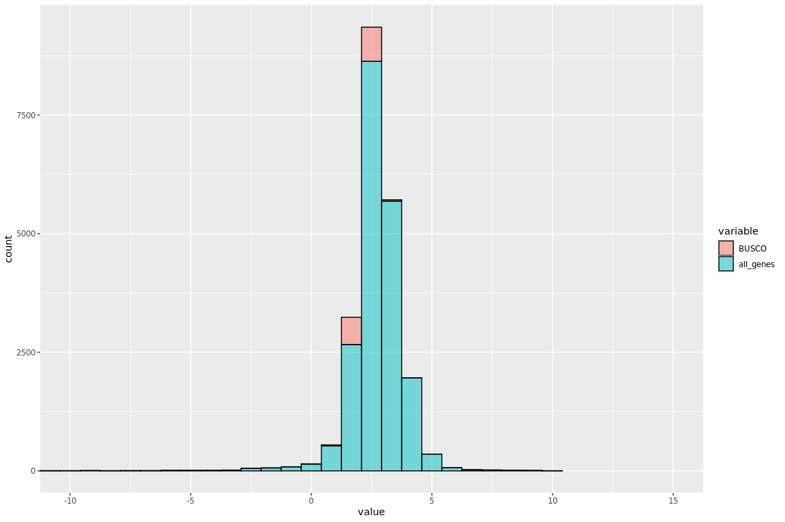<!-- -->

``` r
logTrans <- function(vals) {
   vals_log = log(vals)
   vals_log[is.infinite(vals_log)]<- NA
   return(vals_log)
}

counts_log = logTrans(counts)

pop_sd <- sd(counts_log,na.rm = T)*sqrt((length(counts_log)-1)/(length(counts_log)))
pop_mean <- mean(counts_log, na.rm = T)

calc_zScore <- function(vector_vals, sd, mean) {
   Zvector_vals = (vector_vals - mean) / sd
   return(Zvector_vals)
}

ws_quantTransGF$z_vals = calc_zScore(logTrans(ws_quantTransGF$TPM), pop_sd, pop_mean)
sum(abs(ws_quantTransGF$z_vals) > 2, na.rm = T)
```

    ## [1] 2283

``` r
#-------------------------------------------------------------------------------
##Calculate Z score - Q903
#POPULATION PARAMETER CALCULATIONS

counts = q_quantTrans$TPM
hist(log10(counts))
hist(log(counts))
```

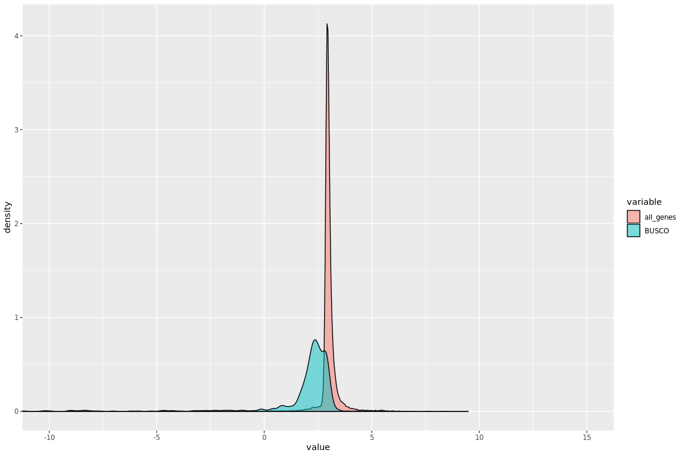<!-- -->

``` r
counts_log = logTrans(counts)

pop_sd <- sd(counts_log,na.rm = T)*sqrt((length(counts_log)-1)/(length(counts_log)))
pop_mean <- mean(counts_log, na.rm = T)

q_quantTransGF$z_vals = calc_zScore(logTrans(q_quantTransGF$TPM), pop_sd, pop_mean)
sum(abs(q_quantTransGF$z_vals) > 2, na.rm = T)
```

    ## [1] 1827

``` r
#-----------------------------------------------------------------------
#plot values - Q903
q_quantTrans$TPMlog = logTrans(q_quantTrans$TPM)
q_quantTransmelt = melt(q_quantTrans[,c("Name","TPMlog")])
q_quantTransmelt$variable = rep("BUSCO",nrow(q_quantTransmelt))
q_quantTransGF$TPMlog = logTrans(q_quantTransGF$TPM)
q_quantTransGFmelt = melt(q_quantTransGF[,c("Name","TPMlog")])
q_quantTransGFmelt$variable = rep("gene_family",nrow(q_quantTransGFmelt))

q_quantTransAll = rbind(q_quantTransGFmelt,q_quantTransmelt)

ggplot(q_quantTransAll, aes(x = value, fill = variable)) + 
  geom_density(alpha = 0.5) + 
  coord_cartesian(xlim = c(-10, 15))
```

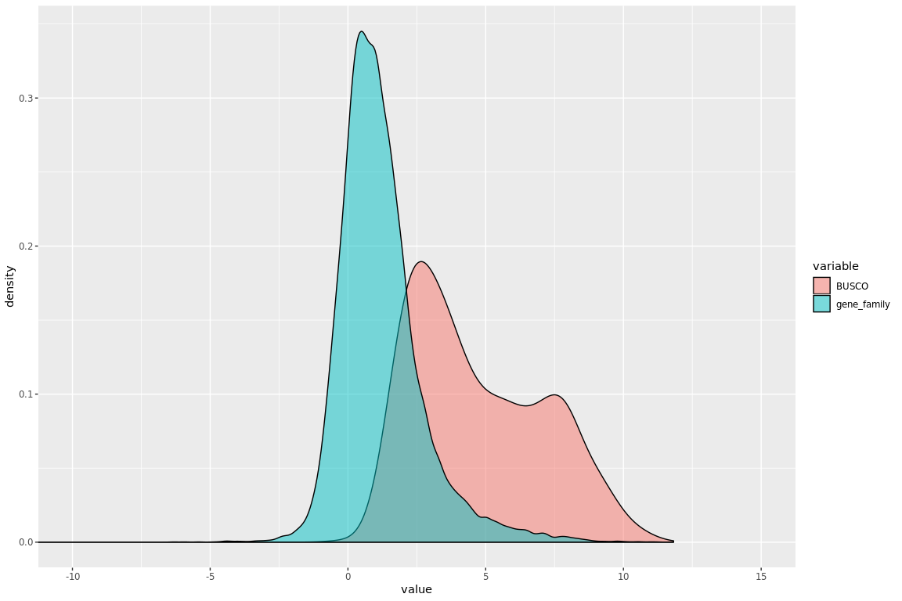<!-- -->

``` r
ggplot(q_quantTransAll, aes(x = value, fill = variable)) + 
  geom_histogram(alpha = 0.5) + 
  coord_cartesian(xlim = c(-10, 15))
```

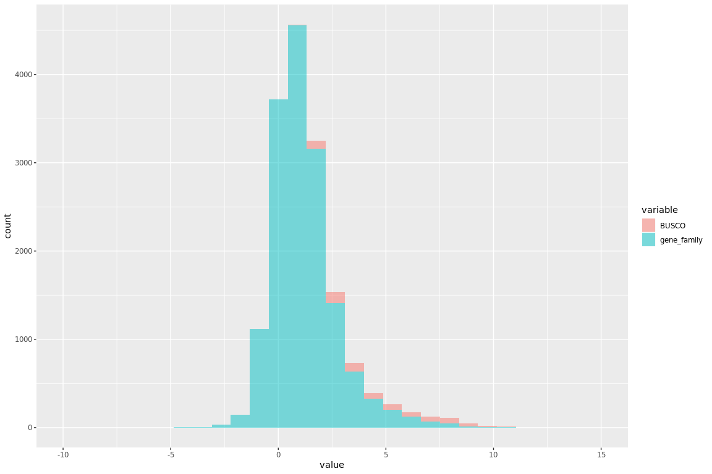<!-- -->

``` r
#plot values - WS77111
ws_quantTrans$TPMlog = logTrans(ws_quantTrans$TPM)
ws_quantTransmelt = melt(ws_quantTrans[,c("Name","TPMlog")])
ws_quantTransmelt$variable = rep("BUSCO",nrow(ws_quantTransmelt))
ws_quantTransGF$TPMlog = logTrans(ws_quantTransGF$TPM)
ws_quantTransGFmelt = melt(ws_quantTransGF[,c("Name","TPMlog")])
ws_quantTransGFmelt$variable = rep("gene_family",nrow(ws_quantTransGFmelt))

ws_quantTransAll = rbind(ws_quantTransGFmelt,ws_quantTransmelt)

ggplot(ws_quantTransAll, aes(x = value, fill = variable)) + 
  geom_density(alpha = 0.5) + 
  coord_cartesian(xlim = c(-10, 15))
```

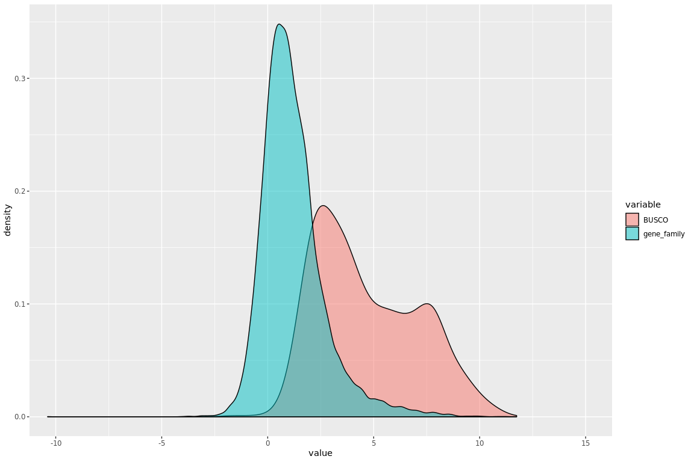<!-- -->

``` r
ggplot(ws_quantTransAll, aes(x = value, fill = variable)) + 
  geom_histogram(alpha = 0.5) + 
  coord_cartesian(xlim = c(-10, 15))
```

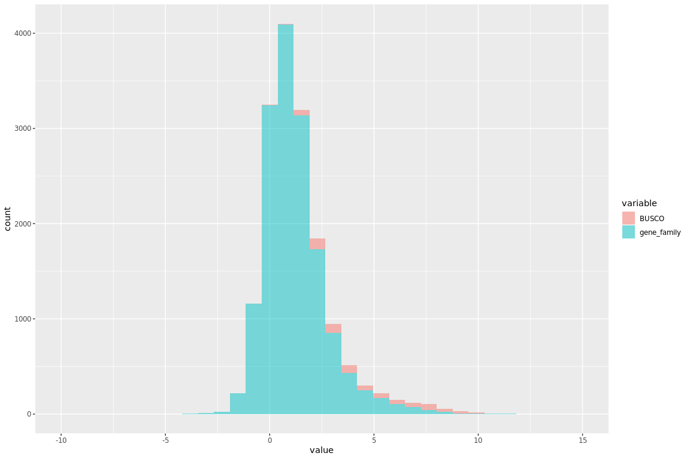<!-- -->

``` r
fcws_q = log(ws_quantGF$TPM) - log(q_quantGF$TPM)

sum(fcws_q > 0.58, na.rm = T)
```

    ## [1] 633
