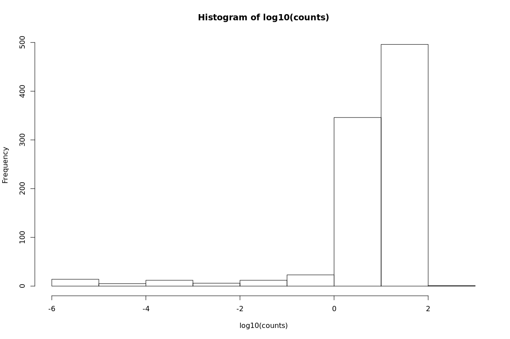
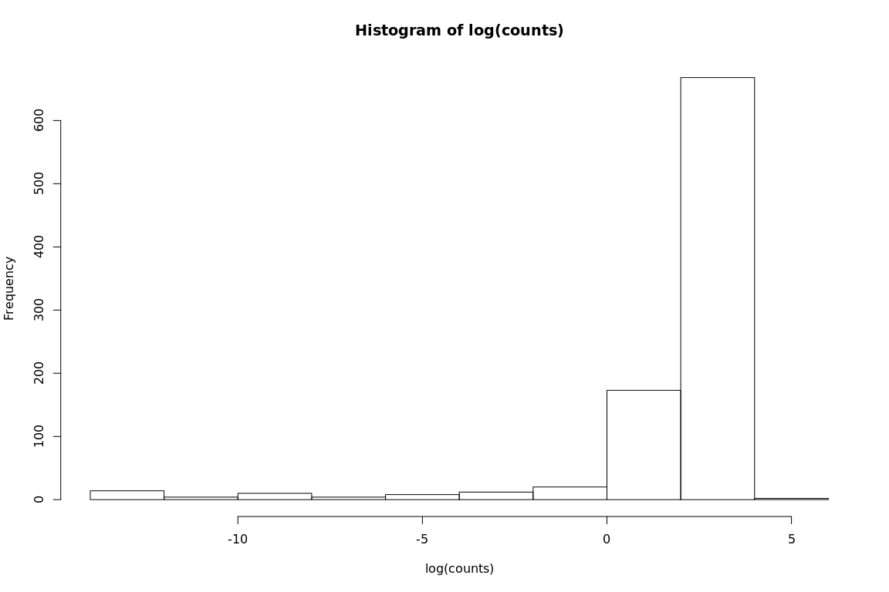
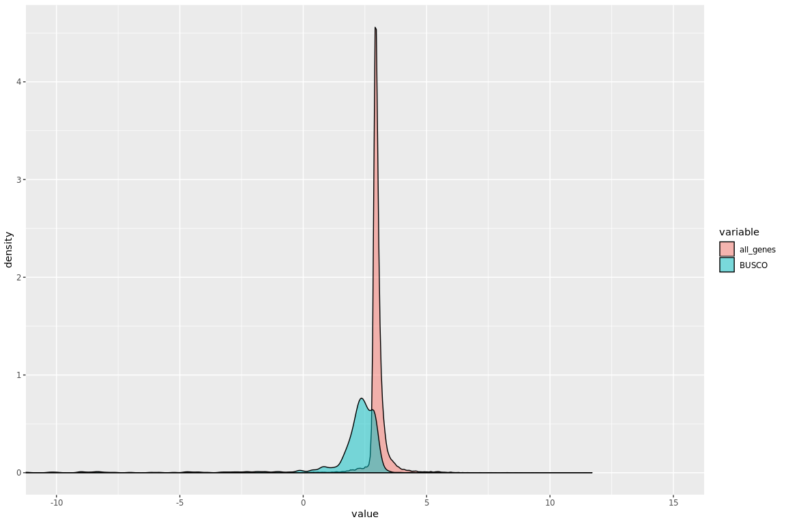
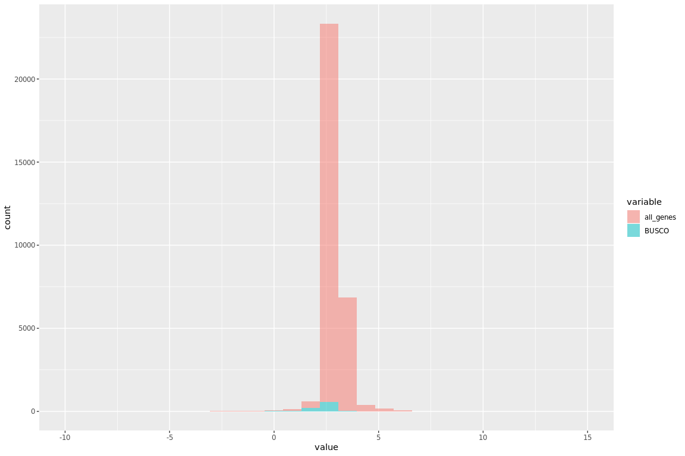
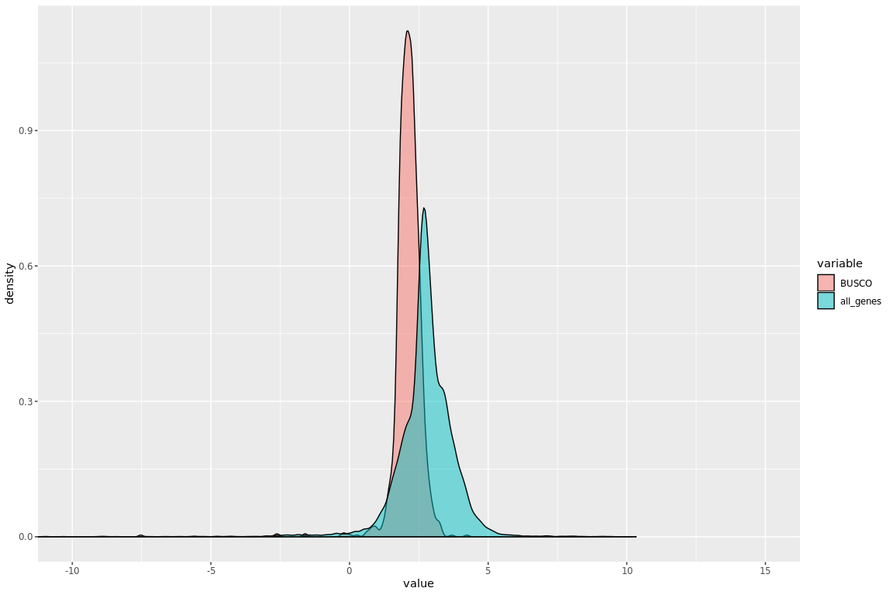
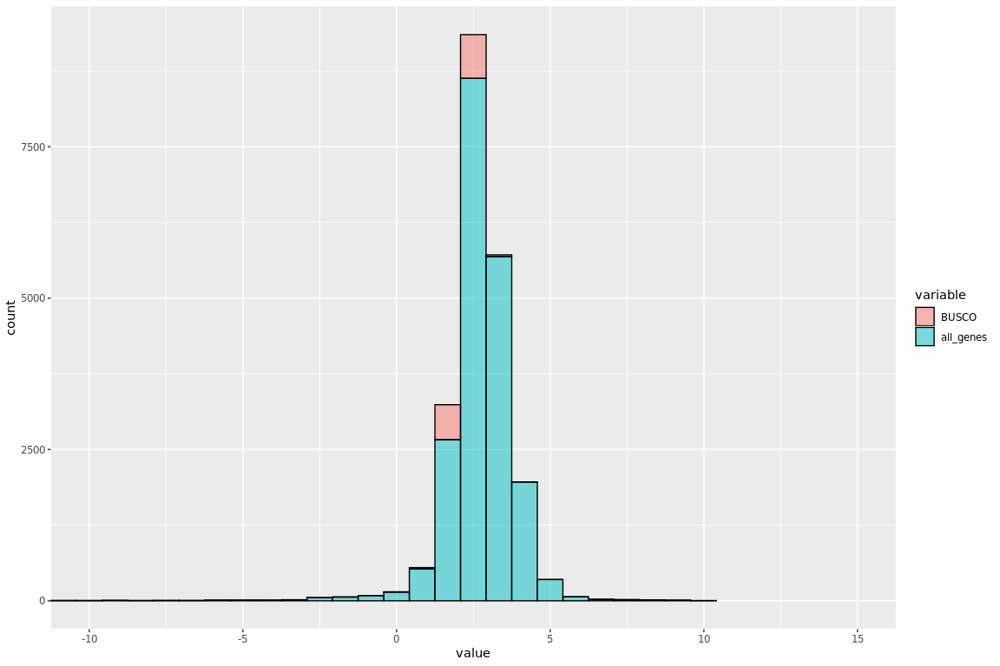
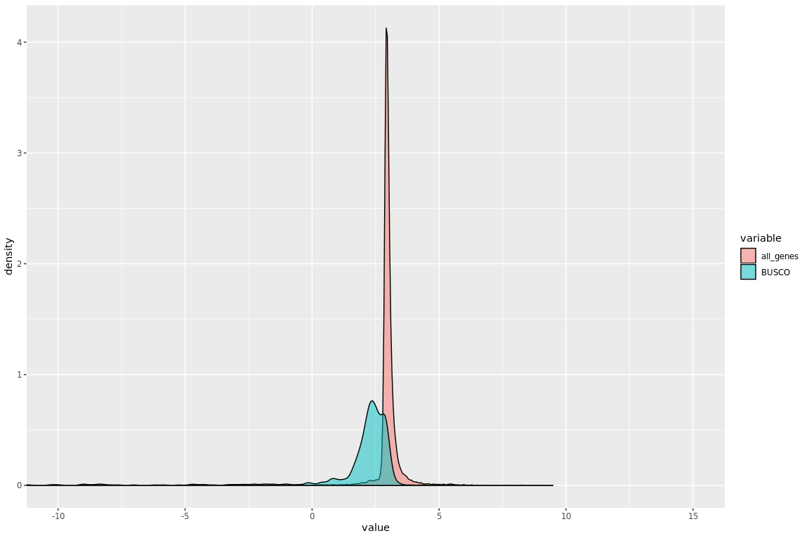

Compare TPM - A.thaliana
================

## Analysis gene expression - genome

### BUSCO genes - masked repeats

``` r
library(reshape)
library(ggplot2)

quantBUSCO = read.delim("/projects/btl_scratch/kgagalova/PipelineCNV/Salmon/Athaliana/Genes/Athaliana_quant/quant.genes.buscos.sf", header = T)
quantcDNA = read.delim("/projects/btl_scratch/kgagalova/PipelineCNV/Salmon/Athaliana/Genes/Athaliana_quant/quant.genes.cDNA.sf", header = T)

summary(quantBUSCO$NumReads)
```

    ##    Min. 1st Qu.  Median    Mean 3rd Qu.    Max. 
    ##     0.0     0.0   486.9   725.3  1071.1 15869.6

``` r
summary(quantcDNA$NumReads)
```

    ##    Min. 1st Qu.  Median    Mean 3rd Qu.    Max. 
    ##       0     737    1213    1707    1842 3651940

``` r
summary(quantBUSCO$TPM)
```

    ##    Min. 1st Qu.  Median    Mean 3rd Qu.    Max. 
    ##    0.00    0.00    6.85    7.26   12.22  188.25

``` r
summary(quantcDNA$TPM)
```

    ##      Min.   1st Qu.    Median      Mean   3rd Qu.      Max. 
    ##      0.00     18.13     19.43     31.64     21.58 120810.00

``` r
#cor(ws_quant$TPM,q_quant$TPM)
#cor(ws_quant$NumReads,q_quant$NumReads)

#-------------------------------------------------------------------------------
##Calculate Z score - WS77111
#POPULATION PARAMETER CALCULATIONS

counts = quantBUSCO$TPM
hist(log10(counts))
```

<!-- -->

``` r
hist(log(counts))
```

<!-- -->

``` r
logTrans <- function(vals) {
   vals_log = log(vals)
   vals_log[is.infinite(vals_log)]<- NA
   return(vals_log)
}

#counts_log = logTrans(counts)
#pop_sd <- sd(counts_log,na.rm = T)*sqrt((length(counts_log)-1)/(length(counts_log)))
#pop_mean <- mean(counts_log, na.rm = T)

calc_zScore <- function(vector_vals, sd, mean) {
   Zvector_vals = (vector_vals - mean) / sd
   return(Zvector_vals)
}

#ws_quantGF$z_vals = calc_zScore(logTrans(ws_quantGF$TPM), pop_sd, pop_mean)
#sum(abs(ws_quantGF$z_vals) > 2, na.rm = T)
#-------------------------------------------------------------------------------
##Calculate Z score - Q903
#POPULATION PARAMETER CALCULATIONS

#counts = q_quant$TPM
#hist(log10(counts))
#hist(log(counts))

#counts_log = logTrans(counts)

#pop_sd <- sd(counts_log,na.rm = T)*sqrt((length(counts_log)-1)/(length(counts_log)))
#pop_mean <- mean(counts_log, na.rm = T)

#q_quantGF$z_vals = calc_zScore(logTrans(q_quantGF$TPM), pop_sd, pop_mean)
#sum(abs(q_quantGF$z_vals) > 2, na.rm = T)

#-----------------------------------------------------------------------
#plot values
quantBUSCO$TPMlog = logTrans(quantBUSCO$TPM)
b_quantmelt = melt(quantBUSCO[,c("Name","TPMlog")])
b_quantmelt$variable = rep("BUSCO",nrow(b_quantmelt))
quantcDNA$TPMlog = logTrans(quantcDNA$TPM)
quantcDNAmelt = melt(quantcDNA[,c("Name","TPMlog")])
quantcDNAmelt$variable = rep("all_genes",nrow(quantcDNAmelt))

quantAll = rbind(b_quantmelt,quantcDNAmelt)

ggplot(quantAll, aes(x = value, fill = variable)) + 
  geom_density(alpha = 0.5) + 
  coord_cartesian(xlim = c(-10, 15))
```

<!-- -->

``` r
ggplot(quantAll, aes(x = value, fill = variable)) + 
  geom_histogram(alpha = 0.5) +
  coord_cartesian(xlim = c(-10, 15))
```

<!-- -->

``` r
table(quantAll$variable)
```

    ## 
    ## all_genes     BUSCO 
    ##     31287      1401

### BUSCO genes - Transcript Sequences

``` r
b_quantTrans <- read.delim("/projects/btl_scratch/kgagalova/PipelineCNV/Salmon/Athaliana/Transcripts/AthalianaSumulated/Athaliana_quant/quant.genes.buscos.sf",header = T)
g_quantTrans <- read.delim("/projects/btl_scratch/kgagalova/PipelineCNV/Salmon/Athaliana/Transcripts/AthalianaSumulated/Athaliana_quant/quant.genes.genes.sf", header = T)

summary(b_quantTrans$NumReads)
```

    ##    Min. 1st Qu.  Median    Mean 3rd Qu.    Max. 
    ##     0.0   375.5   585.0   659.2   843.0  7496.1

``` r
summary(g_quantTrans$NumReads)
```

    ##    Min. 1st Qu.  Median    Mean 3rd Qu.    Max. 
    ##       0     310     693    1415    1330 1603470

``` r
summary(b_quantTrans$TPM)
```

    ##    Min. 1st Qu.  Median    Mean 3rd Qu.    Max. 
    ##   0.000   6.498   8.289   8.765  10.545  68.859

``` r
summary(g_quantTrans$TPM)
```

    ##      Min.   1st Qu.    Median      Mean   3rd Qu.      Max. 
    ##     0.000     8.224    14.886    33.663    25.069 30817.100

``` r
#cor(ws_quantTrans$TPM,q_quantTrans$TPM)
#or(ws_quantTrans$NumReads,q_quantTrans$NumReads)

#-------------------------------------------------------------------------------
##Calculate Z score - WS77111
#POPULATION PARAMETER CALCULATIONS

#counts = ws_quantTrans$TPM
#hist(log10(counts))
#hist(log(counts))

#logTrans <- function(vals) {
#   vals_log = log(vals)
#   vals_log[is.infinite(vals_log)]<- NA
#   return(vals_log)
#}

#counts_log = logTrans(counts)

#pop_sd <- sd(counts_log,na.rm = T)*sqrt((length(counts_log)-1)/(length(counts_log)))
#pop_mean <- mean(counts_log, na.rm = T)

#ws_quantTransGF$z_vals = calc_zScore(logTrans(ws_quantTransGF$TPM), pop_sd, pop_mean)
#sum(abs(ws_quantTransGF$z_vals) > 2, na.rm = T)
#-------------------------------------------------------------------------------
##Calculate Z score - Q903
#POPULATION PARAMETER CALCULATIONS

#counts = q_quantTrans$TPM
#hist(log10(counts))
#hist(log(counts))

#counts_log = logTrans(counts)

#pop_sd <- sd(counts_log,na.rm = T)*sqrt((length(counts_log)-1)/(length(counts_log)))
#pop_mean <- mean(counts_log, na.rm = T)

#q_quantTransGF$z_vals = calc_zScore(logTrans(q_quantTransGF$TPM), pop_sd, pop_mean)
#sum(abs(q_quantTransGF$z_vals) > 2, na.rm = T)

#-----------------------------------------------------------------------
#plot values - Q903
b_quantTrans$TPMlog = logTrans(b_quantTrans$TPM)
b_quantTransmelt = melt(b_quantTrans[,c("Name","TPMlog")])
b_quantTransmelt$variable = as.factor(rep("BUSCO",nrow(b_quantTransmelt)))

g_quantTrans$TPMlog = logTrans(g_quantTrans$TPM)
g_quantTransmelt = melt(g_quantTrans[,c("Name","TPMlog")])
g_quantTransmelt$variable = as.factor(rep("all_genes",nrow(g_quantTransmelt)))

quantTransAll = rbind(b_quantTransmelt,g_quantTransmelt)

table(quantTransAll$variable)
```

    ## 
    ##     BUSCO all_genes 
    ##      1401     22199

``` r
ggplot(quantTransAll, aes(x = value, fill = variable)) + 
  geom_density(alpha = 0.5) + 
  coord_cartesian(xlim = c(-10, 15))
```

<!-- -->

``` r
ggplot(quantTransAll, aes(x = value, fill = variable)) + 
  geom_histogram(alpha = 0.5,color="black") + 
  coord_cartesian(xlim = c(-10, 15))
```

<!-- -->

``` r
##plot the same genes as for the plot before
quantAllcds = quantAll[which(quantAll$Name %in% quantTransAll$Name),]
table(quantAllcds$variable)
```

    ## 
    ## all_genes     BUSCO 
    ##     22168      1401

``` r
ggplot(quantAllcds, aes(x = value, fill = variable)) + 
  geom_density(alpha = 0.5) + 
  coord_cartesian(xlim = c(-10, 15))
```

<!-- -->
