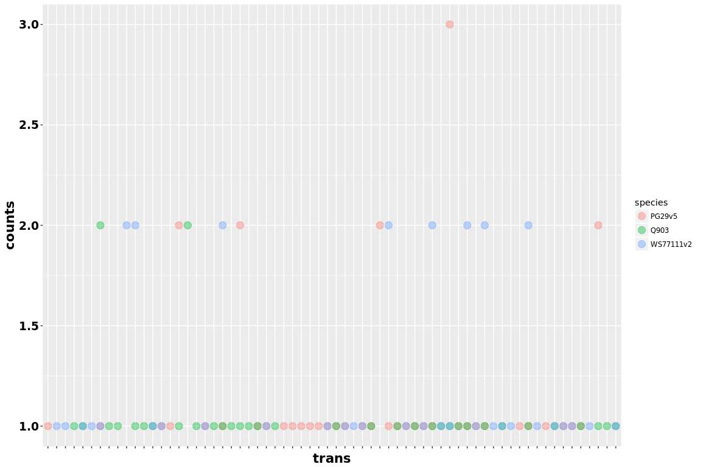

Check gene copies - TP CYP
================

Load data sets - Aligned with GMAP
----------------------------------

Filtered by completeness, no stop codons and only canonical splice sites

``` r
library( dplyr )
library( ggplot2 )
library( tidyr )
library( data.table )

dataPath="/projects/spruceup_scratch/dev/SprucePaper2018/GeneOfInterest/TPS_CYP/GMAP/CountsPerSpecies/HighCovCompleteOnly"
allFiles <- list.files( path = dataPath, pattern = ".txt", full.names = TRUE )

l <- lapply( allFiles, function( fn ){
  d <- read.table( fn, header = F );
  d$fileName <- fn;
  d
  } );

d <- bind_rows( l );
dim(d)
```

    ## [1] 175   3

``` r
d$species = sapply(strsplit(gsub("_valsThCountsAlignmentsCompl.txt","",gsub("allCounts.txt","",sapply(strsplit(d$fileName,"/"),"[[",11))),"_"),"[[",1)
d$class = sapply(strsplit(gsub("_valsThCountsAlignmentsCompl.txt","",gsub("allCounts.txt","",sapply(strsplit(d$fileName,"/"),"[[",11))),"_"),"[[",2)

colnames(d) = c("counts","trans","fileName","species","class")
table(d$species,d$class)
```

    ##            
    ##             cyp tps
    ##   PG29v5     56   5
    ##   Q903       54   3
    ##   WS77111v2  53   4

``` r
d_cast = dcast(d, trans ~ species, value.var="counts")
d_cast[is.na(d_cast)] <- 0

setwd("/projects/btl/kgagalova/PHD_projects2/SpruceUp/SpruceUpPaper/doc/GeneOfInterest/")
write.table(d_cast,file="CopiesGenesCompl.txt",quote=F,sep="\t", row.names = F)

#get the different ones only
to_rem = which(d_cast$PG29v5 == d_cast$Q903 & d_cast$WS77111v2 == d_cast$Q903)
d_castDiff = d_cast[-to_rem,]

write.table(d_cast[,c("trans","PG29v5","Q903","WS77111v2")],file="CopiesComplGenesDiff.txt",quote=F,sep="\t", row.names = F)

trans_diff = d_castDiff$trans
d_diff = d[which(d$trans %in% trans_diff),]

ggplot(d_diff,aes(trans,counts)) + geom_point(aes(colour=species),size=4,alpha=0.4) + 
   theme(axis.title.x = element_text(face='bold',size=16,hjust=0.5),
          axis.title.y = element_text(face='bold',size=16,vjust=1),
          axis.text.x = element_blank(),
          axis.text.y = element_text(face='bold',size=14,color='black'))
```



``` r
dataPath="/projects/spruceup_scratch/dev/SprucePaper2018/GeneOfInterest/TPS_CYP/GMAP/CountsPerSpecies/HighCov"
allFiles <- list.files( path = dataPath, pattern = ".txt", full.names = TRUE )

l <- lapply( allFiles, function( fn ){
  d <- read.table( fn, header = F );
  d$fileName <- fn;
  d
  } );

d1 <- bind_rows( l );
dim(d1)
```

    ## [1] 557   3

``` r
d1$species = sapply(strsplit(gsub("_valsThCountsAlignments.txt","",gsub("allCounts.txt","",sapply(strsplit(d1$fileName,"/"),"[[",11))),"_"),"[[",1)
d1$class = sapply(strsplit(gsub("_valsThCountsAlignments.txt","",gsub("allCounts.txt","",sapply(strsplit(d1$fileName,"/"),"[[",11))),"_"),"[[",2)

colnames(d1) = c("counts","trans","fileName","species","class")
table(d1$species,d1$class)
```

    ##            
    ##             cyp tps
    ##   PG29v5    155  17
    ##   Q903      168  30
    ##   WS77111v2 165  22

``` r
d1_cast = dcast(d1, trans ~ species, value.var="counts")
d1_cast[is.na(d1_cast)] <- 0

setwd("/projects/btl/kgagalova/PHD_projects2/SpruceUp/SpruceUpPaper/doc/GeneOfInterest/")
write.table(d1_cast,file="CopiesGenes.txt",quote=F,sep="\t", row.names = F)

#get the different ones only
to_rem = which(d1_cast$PG29v5 == d1_cast$Q903 & d1_cast$WS77111v2 == d1_cast$Q903)
d1_castDiff = d1_cast[-to_rem,]

write.table(d1_cast[,c("trans","PG29v5","Q903","WS77111v2")],file="CopiesGenesDiff.txt",quote=F,sep="\t", row.names = F)

trans_diff = d1_castDiff$trans
d1_diff = d1[which(d1$trans %in% trans_diff),]
```
