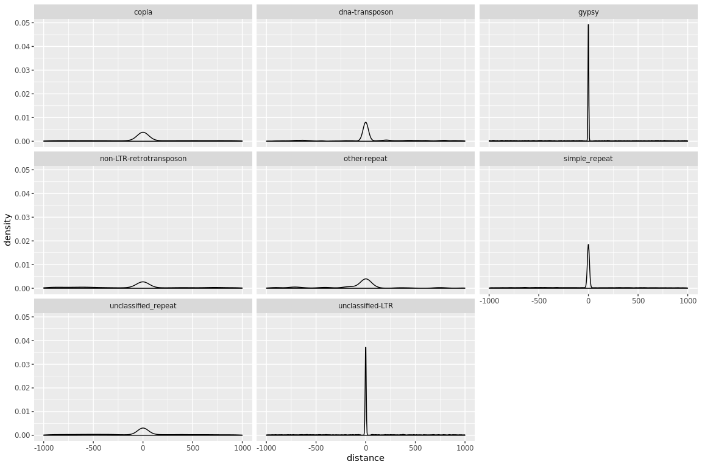
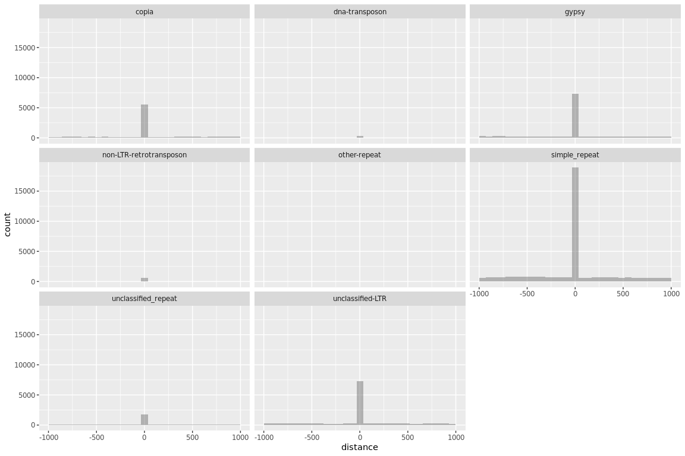
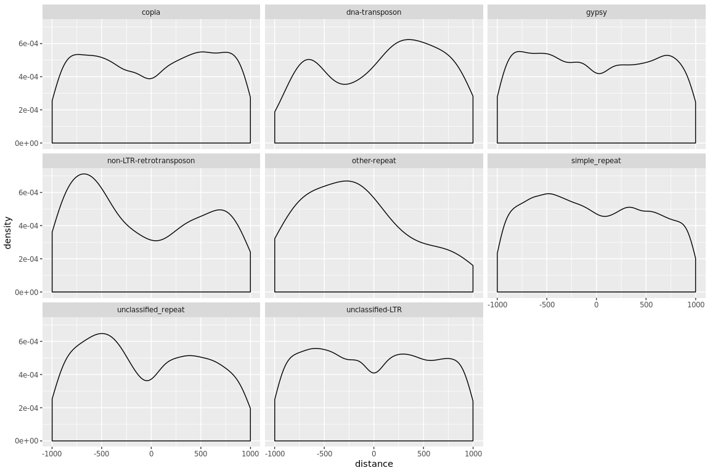
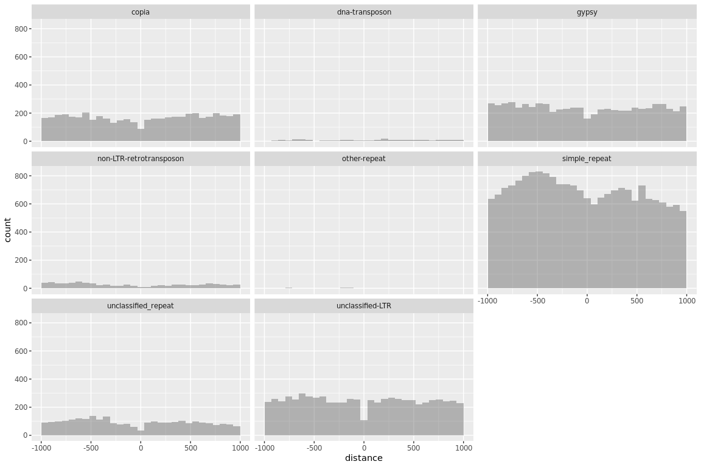
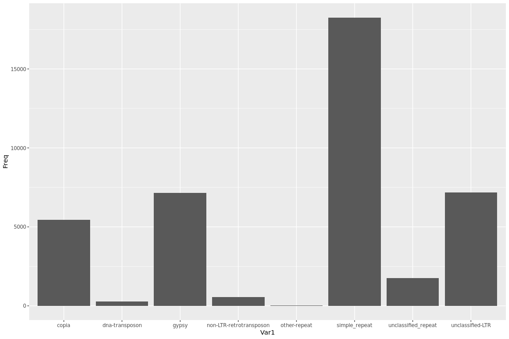

Check repeats distance from genes
================

## Load the file with the intervals

``` r
KbpHQDist <- read.delim("/projects/spruceup_scratch/dev/SprucePaper2018/GenesRepeats/WS77111/WS77111-v2_1000plus_allAnnotated.DistHQPolish1Kbp.out", header=FALSE)

colnames(KbpHQDist) = c("scaffold","gene","repeat","rep_class","distance")

#number of genes that are not found on scaffold with repeats
nrow(subset(KbpHQDist,rep_class == "."))
```

    ## [1] 26

``` r
KbpHQDistPolish = subset(KbpHQDist,rep_class != ".")

table(KbpHQDistPolish$rep_class)
```

    ## 
    ##                       .                   copia          dna-transposon 
    ##                       0                   10354                     508 
    ##                   gypsy non-LTR-retrotransposon            other-repeat 
    ##                   14029                    1331                      62 
    ##           simple_repeat     unclassified_repeat        unclassified-LTR 
    ##                   38346                    4446                   14326

``` r
df_KbpHQDistPolishGeneOverlap = as.data.frame(table(as.character(subset(KbpHQDistPolish, distance == 0)$rep_class)))
```

## Plot distance

``` r
library(dplyr)
library(ggplot2)

ggplot(data = KbpHQDistPolish, aes(x=distance)) + geom_density(alpha = 0.4) + facet_wrap( ~ rep_class)
```

<!-- -->

``` r
ggplot(data = KbpHQDistPolish, aes(x=distance)) + geom_histogram(alpha = 0.4) + facet_wrap( ~ rep_class)
```

<!-- -->

``` r
KbpHQDistPolish %>% 
  group_by(rep_class) %>% 
  summarize(mean = mean(distance),
            med = median(distance),
            mad = mad(distance))
```

    ## # A tibble: 8 x 4
    ##   rep_class                 mean   med   mad
    ##   <fct>                    <dbl> <dbl> <dbl>
    ## 1 copia                     6.86     0   0  
    ## 2 dna-transposon           36.9      0   0  
    ## 3 gypsy                   -10.5      0   0  
    ## 4 non-LTR-retrotransposon -56.7      0 357. 
    ## 5 other-repeat            -82.9      0   0  
    ## 6 simple_repeat           -21.4      0  74.1
    ## 7 unclassified_repeat     -34.8      0 323. 
    ## 8 unclassified-LTR         -7.52     0   0

``` r
#no overlap
KbpHQDistPolishNoOver =  subset(KbpHQDistPolish, distance != 0)

ggplot(data = KbpHQDistPolishNoOver, aes(x=distance)) + geom_density(alpha = 0.4) + facet_wrap( ~ rep_class)
```

<!-- -->

``` r
ggplot(data = KbpHQDistPolishNoOver, aes(x=distance)) + geom_histogram(alpha = 0.4) + facet_wrap( ~ rep_class)
```

<!-- -->

``` r
ggplot(data=df_KbpHQDistPolishGeneOverlap, aes(x=Var1, y=Freq)) +
  geom_bar(stat="identity")
```

<!-- -->
