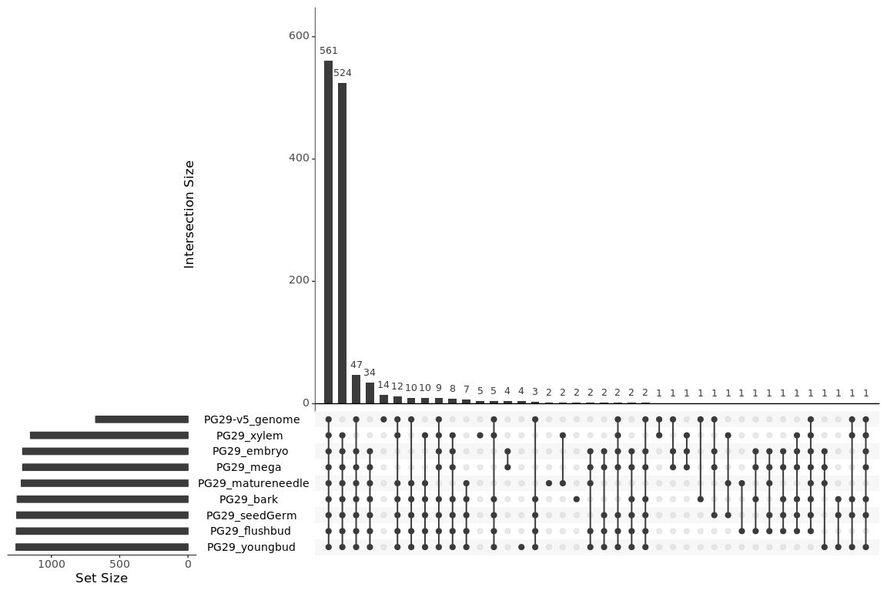
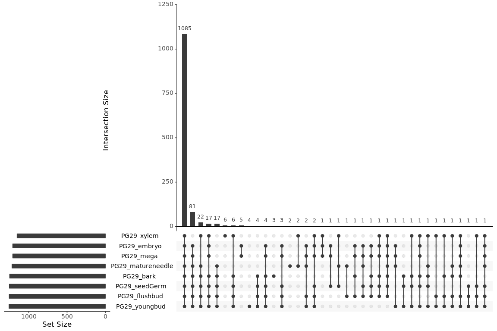
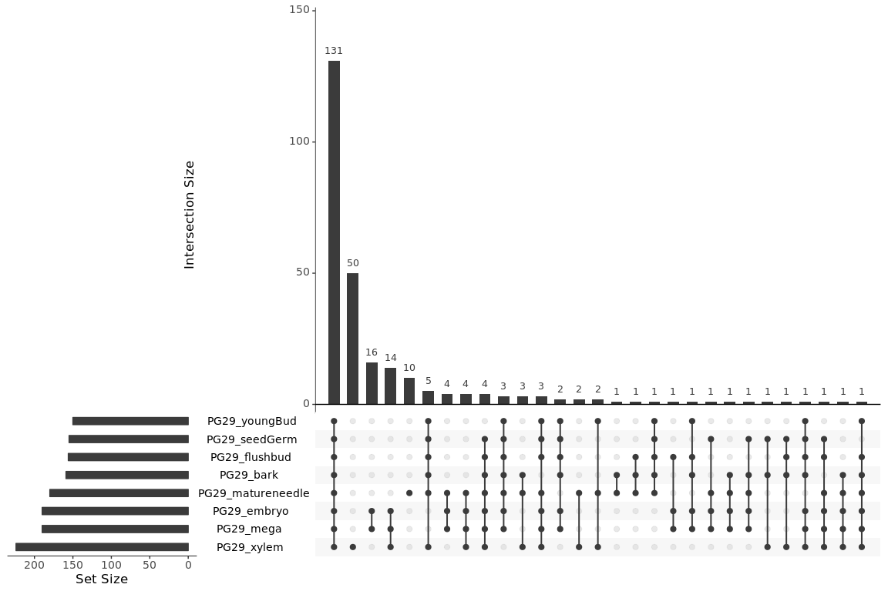
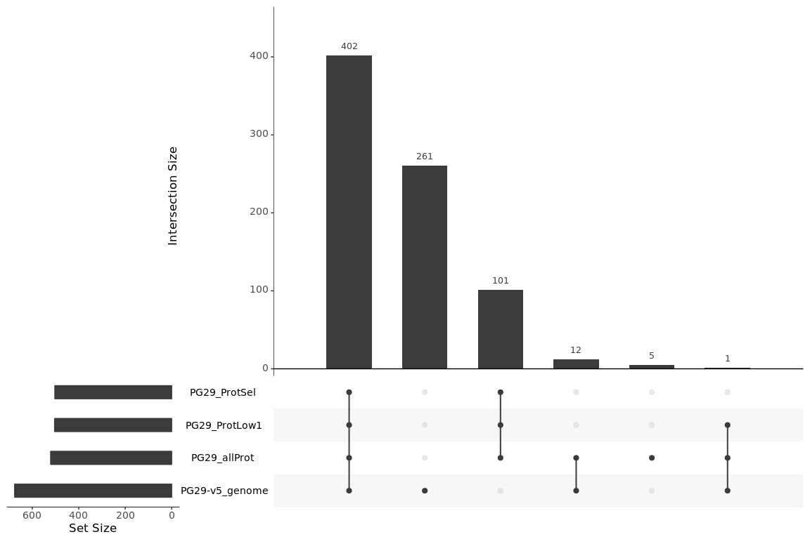
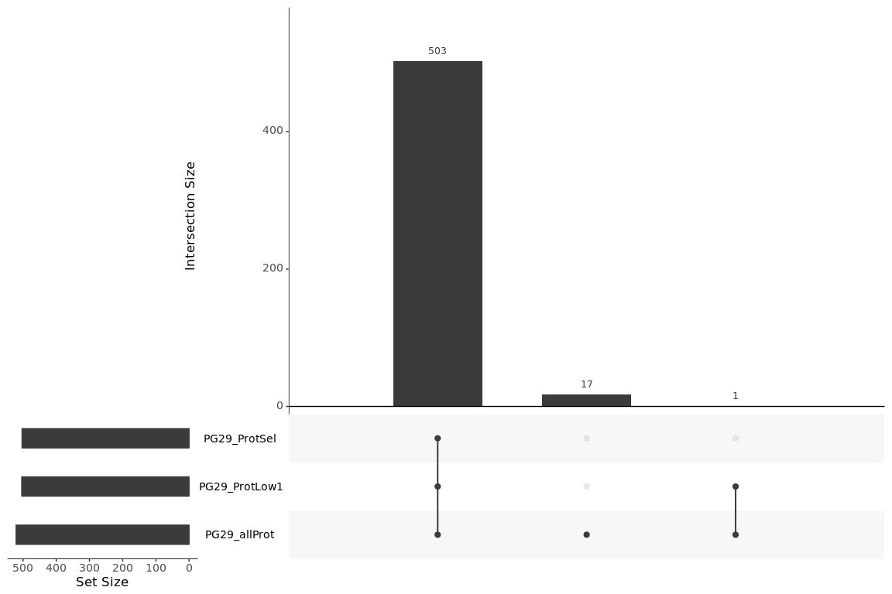
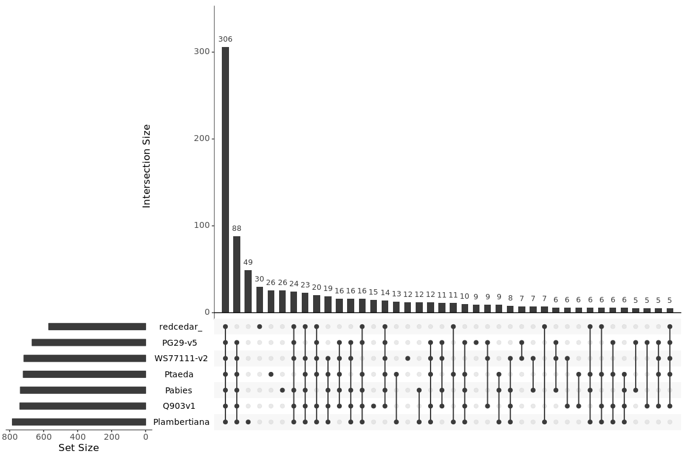
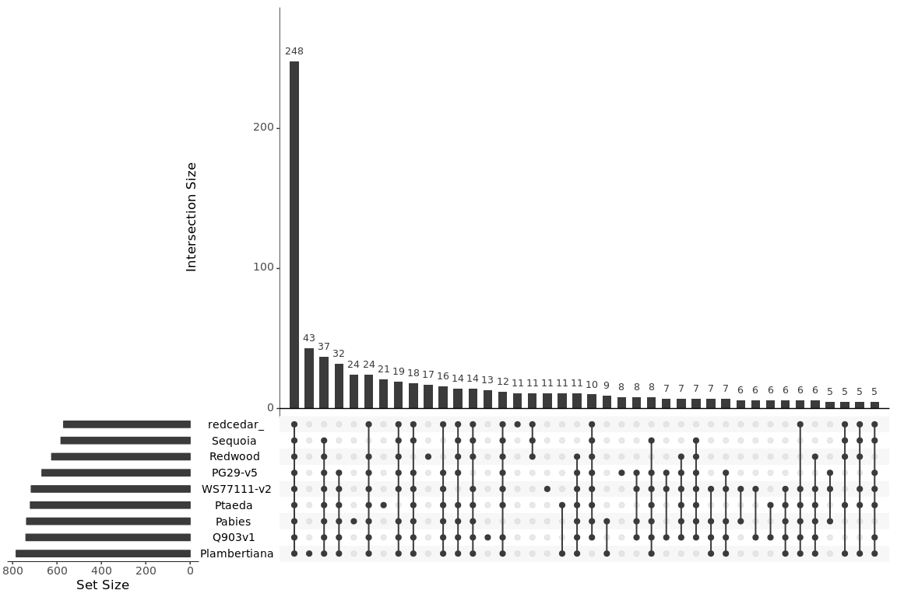
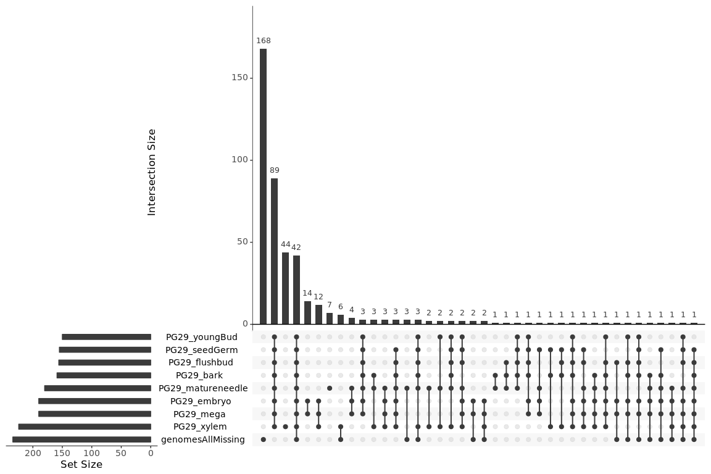

Check the overlap between complete BUSCOs in the transcriptome and the genome
================

Load data
---------

``` r
library( dplyr )
library( ggplot2 )
library( tidyr )
library( data.table )
library( reshape )
library( UpSetR )

dataPath="/projects/spruceup_scratch/dev/SprucePaper2018/CompareBUSCOs/Transcriptome/PG29/BUSCOcomplete"
allFiles <- list.files( path = dataPath, pattern = "Complete.in", full.names = TRUE )

l <- lapply( allFiles, function( fn ){
  d <- read.table( fn, header = F );
  d$fileName <- fn;
  d
} );

complete <- bind_rows( l );
dim(complete)
```

    ## [1] 10488     2

``` r
complete$nam = gsub("Complete.in","",gsub("full_table_","",sapply(strsplit(sapply(strsplit(complete$fileName,"/"),"[[",10),"\\="),"[[",1)))

complete_long = unstack(complete[,c("V1","nam")])

upset(fromList(complete_long),order.by = "freq",nsets=9, text.scale = 1.5)
```



``` r
#exclude genome
complete_trans = subset(complete, complete$nam != "PG29-v5_genome")
complete_long_trans = unstack(complete_trans[,c("V1","nam")])

upset(fromList(complete_long_trans),order.by = "freq",nsets=9, text.scale = 1.5)
```



``` r
###Missing

dataPath="/projects/spruceup_scratch/dev/SprucePaper2018/CompareBUSCOs/Transcriptome/PG29/BUSCOmissing"
allFiles <- list.files( path = dataPath, pattern = "Missing.in", full.names = TRUE )

l <- lapply( allFiles, function( fn ){
  d <- read.table( fn, header = F );
  d$fileName <- fn;
  d
} );

missing <- bind_rows( l );
dim(missing)
```

    ## [1] 1404    2

``` r
missing$nam = gsub("Missing.in","",gsub("full_table_","",sapply(strsplit(sapply(strsplit(missing$fileName,"/"),"[[",10),"\\="),"[[",1)))

missing_long = unstack(missing[,c("V1","nam")])

upset(fromList(missing_long),order.by = "freq",nsets=9, text.scale = 1.5)
```



``` r
#exclude genome
complete_trans = subset(complete, complete$nam != "PG29-v5_genome")
complete_long_trans = unstack(complete_trans[,c("V1","nam")])

upset(fromList(complete_long_trans),order.by = "freq",nsets=9, text.scale = 1.5)
```


``` r
dataPath="/projects/spruceup_scratch/dev/SprucePaper2018/CompareBUSCOs/Proteome/PG29/BUSCOcomplete"
allFiles <- list.files( path = dataPath, pattern = "Complete.in", full.names = TRUE )

l <- lapply( allFiles, function( fn ){
  d <- read.table( fn, header = F );
  d$fileName <- fn;
  d
} );

complete_prot <- bind_rows( l );
dim(complete_prot)
```

    ## [1] 2204    2

``` r
complete_prot$nam = gsub("Complete.in","",gsub("full_table_","",sapply(strsplit(sapply(strsplit(complete_prot$fileName,"/"),"[[",10),"\\="),"[[",1)))

complete_prot_long = unstack(complete_prot[,c("V1","nam")])

upset(fromList(complete_prot_long),order.by = "freq",nsets=9, text.scale = 1.5)
```



``` r
#exclude genome
complete_prot_gen = subset(complete_prot, complete_prot$nam != "PG29-v5_genome")
complete_prot_gen = unstack(complete_prot_gen[,c("V1","nam")])

upset(fromList(complete_prot_gen),order.by = "freq",nsets=9, text.scale = 1.5)
```



``` r
dataPath="/projects/spruceup_scratch/dev/SprucePaper2018/CompareBUSCOs/7species/BUSCOruns"
allFiles <- list.files( path = dataPath, pattern = "Missing.in", full.names = TRUE )


l <- lapply( allFiles, function( fn ){
  d <- read.table( fn, header = F );
  d$fileName <- fn;
  d
} );

complete_gen <- bind_rows( l );
dim(complete_gen)
```

    ## [1] 4935    2

``` r
complete_gen$nam = gsub("_genome","",gsub("Missing.in","",gsub("full_table_","",sapply(strsplit(sapply(strsplit(complete_gen$fileName,"/"),"[[",9),"\\="),"[[",1))))

complete_gen_long = unstack(complete_gen[,c("V1","nam")])

upset(fromList(complete_gen_long),order.by = "freq",nsets=9, text.scale = 1.5)
```



``` r
dataPath="/projects/spruceup_scratch/dev/SprucePaper2018/CompareBUSCOs/9species/BUSCOruns"
allFiles <- list.files( path = dataPath, pattern = "Missing.in", full.names = TRUE )

l <- lapply( allFiles, function( fn ){
  d <- read.table( fn, header = F );
  d$fileName <- fn;
  d
} );

complete_gen <- bind_rows( l );
dim(complete_gen)
```

    ## [1] 6141    2

``` r
complete_gen$nam = gsub("_genome","",gsub("Missing.in","",gsub("full_table_","",sapply(strsplit(sapply(strsplit(complete_gen$fileName,"/"),"[[",9),"\\="),"[[",1))))

complete_gen_long = unstack(complete_gen[,c("V1","nam")])

upset(fromList(complete_gen_long),order.by = "freq",nsets=9, text.scale = 1.5)
```



``` r
missingInAll9 = complete_gen[,1][which(table(complete_gen[,1]) == 9)]
```

``` r
missing_long$genomesAllMissing = missingInAll9

#plot the overlap of the missing in the transcriptome and the intersection of all genomes
upset(fromList(missing_long),order.by = "freq",nsets=9, text.scale = 1.5)
```


